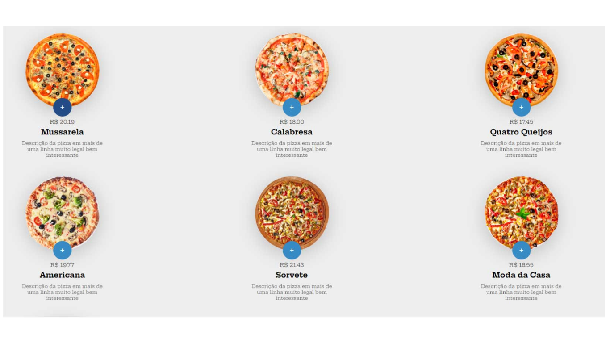

<h1 align="center">
    
</h1>

  <a href="#-tecnologias">Tecnologias</a>&nbsp;&nbsp;&nbsp;|&nbsp;&nbsp;&nbsp;
  <a href="#-projeto">Projeto</a>&nbsp;&nbsp;&nbsp;|&nbsp;&nbsp;&nbsp;
  <a href="#-como-contribuir">Como contribuir</a>&nbsp;&nbsp;&nbsp;|&nbsp;&nbsp;&nbsp;
    <a href="#-instalação">Instalação</a>&nbsp;&nbsp;&nbsp;|&nbsp;&nbsp;&nbsp;
  <a href="#memo-licença">Licença</a>

  

## 🚀 Tecnologias

Esse projeto foi desenvolvido com as seguintes tecnologias:

- [Javascript](https://developer.mozilla.org/en/JavaScript)
- [CSS](https://developer.mozilla.org/pt-BR/docs/Web/CSS)
- [Html](https://www.w3.org/TR/html52/)

## 💻 Projeto

Projedo desenvolvido para treinar minhas habilidades em javascript, todo o layout foi montado com js, com todas as funcionalidades como adicionar no carrinho, soma dos produtos é responsividade

## 📄 Instalação

 <h3>Frontend | Web</h3>
 
 - Basta abrir o arquivo `index.html` que está no diretório inicial do projeto 

## 🤔 Como contribuir

- Faça um fork desse repositório;
- Cria uma branch com a sua feature: `git checkout -b minha-feature`;
- Faça commit das suas alterações: `git commit -m 'feat: Minha nova feature'`;
- Faça push para a sua branch: `git push origin minha-feature`.

Depois que o merge da sua pull request for feito, você pode deletar a sua branch.

## :memo: Licença

Esse projeto está sob a licença MIT. Veja o arquivo [LICENSE](LICENSE.md) para mais detalhes.
